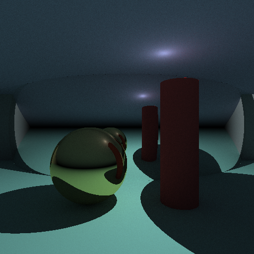

RayStudio
A path tracing raytracing engine that runs in the browser.
A renderer written in C is compiled to WebAssembly (WASM), allowing you to edit scenes and perform rendering from an HTML UI.
Demo

Rendering examples

<p align="center">
  
  
</p>
Features

Path tracing raytracing engine running on WASM
Ability to place spheres, infinite planes, finite planes, cylinders, and light sources
Support for SOLID / METAL materials
3-direction views (TOP / FRONT / SIDE) to confirm objects
Save and load scenes as JSON files
ON/OFF toggle, duplication, and drag-and-drop reordering of objects
Zoom and PNG save functionality for rendering results
Undo with Ctrl+Z or the undo button

How to Use (For Non-Programmers)

Open the site from here
Select an object from the left list and edit its properties
Only objects that are ON will be rendered
Adjust the sample count and resolution in the settings tab
Press the "Render" button to view the results
Save as PNG with the 💾 button

Build Instructions (For Developers)
Requirements

Emscripten 3.0 or later

Compilation
powershellemcc main.c -o renderer.js \
  -s EXPORTED_FUNCTIONS="['_render','_get_buffer_size','_set_object','_set_object_count','_set_camera']" \
  -s EXPORTED_RUNTIME_METHODS="['ccall','cwrap','HEAPU8']" \
  -s ALLOW_MEMORY_GROWTH=1 \
  -O2
Or run the included compile.ps1:
powershellpowershell -ExecutionPolicy Bypass -File compile.ps1
Running Locally
bashpython -m http.server 8080
```

Open `http://localhost:8080` in your browser.

## File Structure
```
index.html          # UI
renderer.js         # WASM wrapper (generated by emcc)
renderer.wasm       # Compiled renderer
main.c              # Renderer main body (WASM entry point)
struct_vec.h        # Vector and structure definitions
intersection.h      # Intersection detection
intersectionpoint.h # Intersection point processing
serch_light_random_d.h # Direct lighting and random reflection
compile.ps1         # Compilation script
Technical Details

Path tracing sends rays to each pixel for sampling
Direct light sampling (with shadow detection)
Indirect light through random hemisphere sampling
METAL material uses specular reflection, SOLID uses Lambertian reflection

License
MIT
